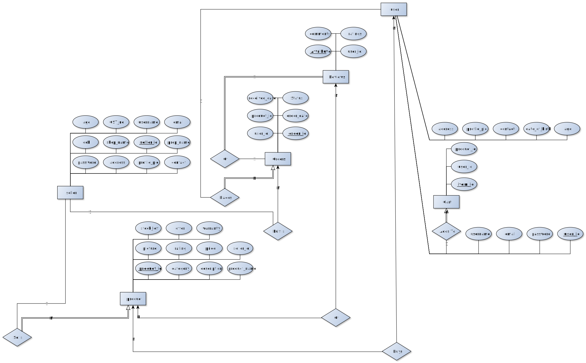

# Scamazon 
Scamazon is an e-commerce website where users can buy and sell products. It is a platform where sellers can list their products and buyers can purchase them. The website provides a user-friendly interface for both buyers and sellers to interact with the platform.
## Tech Stack
- Frontend: React.js
- Backend: Flask
- Database: MySQL

## Features
1. Customer portal
    1. login
    2. cart (add, remove, buy all, buy specific)
    3. past orders
    4. homepage (category wise)
    5. sorting products on basis of price, rating, buyer, offer
    6. review after buying product, (seller specific)
    7. search bar for products
    8. edit profile
2. Seller Portal
    1. login
    2. view stock (products on home page)
    3. update stock
    4. Show orders
    5. customer rating and review
    6. change price and other details
    7. add offer
    8. add new product
    9. remove product 
    10. edit profile
3. Orders
    1. Track order
    2. Cancel order
    3. Return order
    4. Review
    5. Payment history

## ER Diagram
