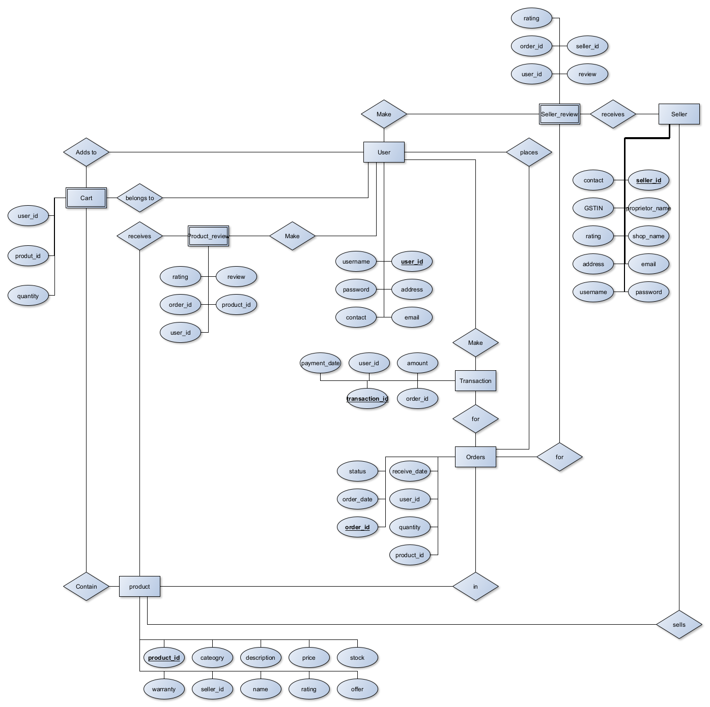

# Scamazon 
Scamazon is an e-commerce website where users can buy and sell products. It is a platform where sellers can list their products and buyers can purchase them. The website provides a user-friendly interface for both buyers and sellers to interact with the platform.
## Tech Stack
- Frontend: React.js
- Backend: Flask
- Database: MySQL

## Features
1. Customer portal
    1. login
    2. cart (add, remove, buy all, buy specific)
    3. past orders
    4. homepage (category wise)
    5. sorting products on basis of price, rating, buyer, offer
    6. review after buying product, (seller specific)
    7. search bar for products
    8. edit profile
2. Seller Portal
    1. login
    2. view stock (products on home page)
    3. update stock
    4. Show orders
    5. customer rating and review
    6. change price and other details
    7. add offer
    8. add new product
    9. remove product 
    10. edit profile
3. Orders
    1. Track order
    2. Cancel order
    3. Return order
    4. Reviews
    5. Payment history

## ER Diagram


## Tables
### 1. Seller
| Field            | Type        | Null | Key | Default | Extra |
|------------------|-------------|------|-----|---------|-------|
| seller_id        | varchar(6)  | NO   | PRI | NULL    |       |
| proprietor_name  | varchar(50) | NO   |     | NULL    |       |
| shop_name        | varchar(50) | NO   |     | NULL    |       |
| email            | varchar(50) | NO   |     | NULL    |UNIQUE |
| password         | varchar(50) | NO   |     | NULL    |       |
| username         | varchar(50) | NO   |     | NULL    |UNIQUE |
| contact          | varchar(10) | NO   |     | NULL    |UNIQUE |
| address          | varchar(100)| NO   |     | NULL    |       |
| GSTIN            | varchar(15) | NO   |     | NULL    |UNIQUE |
| rating           | float       | NO   |     | NULL    |       |

### 2. Product
| Field            | Type        | Null | Key | Default | Extra |
|------------------|-------------|------|-----|---------|-------|
| product_id       | varchar(6)  | NO   | PRI | NULL    |       |
| Name             | varchar(50) | NO   |     | NULL    |       |
| category         | varchar(50) | NO   |     | NULL    |       |
| description      | varchar(100)| YES  |     | NULL    |       |
| price            | float       | NO   |     | NULL    |       |
| stock            | int         | NO   |     | NULL    |       |
| rating           | float       | YES  |     | NULL    |       |
| seller_id        | varchar(6)  | NO   | MUL | NULL    |       |
| warranty         | float       | YES  |     | NULL    |       |
| offer            | float       | YES  |     | NULL    |       |

### 3. Orders
| Field            | Type        | Null | Key | Default | Extra |
|------------------|-------------|------|-----|---------|-------|
| order_id         | varchar(6)  | NO   | PRI | NULL    |       |
| order_date       | date        | NO   |     | NULL    |       |
| status           | varchar(50) | NO   |     | NULL    |       |
| product_id       | varchar(6)  | NO   | MUL | NULL    |       |
| user_id          | varchar(6)  | NO   | MUL | NULL    |       |
| quantity         | int         | NO   |     | NULL    |       |
| received_date    | date        | YES  |     | NULL    |       |

### 4. User
| Field            | Type        | Null | Key | Default | Extra |
|------------------|-------------|------|-----|---------|-------|
| user_id          | varchar(6)  | NO   | PRI | NULL    |       |
| username         | varchar(50) | NO   |     | NULL    |UNIQUE |
| email            | varchar(50) | NO   |     | NULL    |UNIQUE |
| password         | varchar(50) | NO   |     | NULL    |       |
| contact          | varchar(10) | NO   |     | NULL    |UNIQUE |
| address          | varchar(100)| NO   |     | NULL    |       |

### 5. Cart
| Field            | Type        | Null | Key | Default | Extra |
|------------------|-------------|------|-----|---------|-------|
| user_id          | varchar(6)  | NO   | MUL | NULL    |       |
| product_id       | varchar(6)  | NO   | MUL | NULL    |       |
| quantity         | int         | NO   |     | 1       |       |

### 6. Product_Review
| Field            | Type        | Null | Key | Default | Extra |
|------------------|-------------|------|-----|---------|-------|
| user_id          | varchar(6)  | NO   | MUL | NULL    |       |
| product_id       | varchar(6)  | NO   | MUL | NULL    |       |
| order_id         | varchar(6)  | NO   | MUL | NULL    |       |
| rating           | float       | NO   |     | NULL    |       |
| review           | varchar(100)| YES  |     | NULL    |       |

### 7. Transaction
| Field            | Type        | Null | Key | Default | Extra |
|------------------|-------------|------|-----|---------|-------|
| transaction_id   | varchar(6)  | NO   | PRI | NULL    |       |
| user_id          | varchar(6)  | NO   | MUL | NULL    |       |
| order_id         | varchar(6)  | NO   | MUL | NULL    |       |
| amount           | float       | NO   |     | NULL    |       |
| payment_date     | date        | NO   |     | NULL    |       |

### 8. Seller_Review
| Field            | Type        | Null | Key | Default | Extra |
|------------------|-------------|------|-----|---------|-------|
| user_id          | varchar(6)  | NO   | MUL | NULL    |       |
| seller_id        | varchar(6)  | NO   | MUL | NULL    |       |
| order_id         | varchar(6)  | NO   | MUL | NULL    |       |
| rating           | float       | NO   |     | NULL    |       |
| review           | varchar(100)| YES  |     | NULL    |       |


## Triggers
### 1. Update_rating
```sql
CREATE TRIGGER Update_rating
AFTER INSERT ON Product_Review
FOR EACH ROW
BEGIN
    DECLARE avg_rating FLOAT;
    DECLARE total_rating FLOAT;
    DECLARE total_reviews INT;
    DECLARE new_rating FLOAT;
    SELECT SUM(rating) INTO total_rating FROM Product_Review WHERE product_id = NEW.product_id;
    SELECT COUNT(*) INTO total_reviews FROM Product_Review WHERE product_id = NEW.product_id;
    SET avg_rating = total_rating / total_reviews;
    UPDATE Product SET rating = avg_rating WHERE product_id = NEW.product_id;
END;
```

### 2. Update_seller_rating
```sql
CREATE TRIGGER Update_seller_rating
AFTER INSERT ON Seller_Review
FOR EACH ROW
BEGIN
    DECLARE avg_rating FLOAT;
    DECLARE total_rating FLOAT;
    DECLARE total_reviews INT;
    DECLARE new_rating FLOAT;
    SELECT SUM(rating) INTO total_rating FROM Seller_Review WHERE seller_id = NEW.seller_id;
    SELECT COUNT(*) INTO total_reviews FROM Seller_Review WHERE seller_id = NEW.seller_id;
    SET avg_rating = total_rating / total_reviews;
    UPDATE Seller SET rating = avg_rating WHERE seller_id = NEW.seller_id;
END;
```

## Relations
### 1. Seller
- One to Many relation with Product
- One to Many relation with Seller_Review

### 2. Product
- Many to One relation with Seller
- One to Many relation with Orders
- One to Many relation with Product_Review

### 3. Orders
- Many to One relation with Product
- Many to One relation with User

### 4. User
- One to Many relation with Orders
- One to Many relation with Cart
- One to Many relation with Product_Review
- One to Many relation with Transaction

### 5. Cart
- Many to One relation with User
- Many to One relation with Product

### 6. Product_Review
- Many to One relation with User
- Many to One relation with Product
- Many to One relation with Orders

### 7. Transaction
- Many to One relation with User
- Many to One relation with Orders

### 8. Seller_Review
- Many to One relation with User
- Many to One relation with Seller
- Many to One relation with Orders

## Contributors
- [Kanishk mittal](https://github.com/Kanishk-mittal)
- [Sayan Sinha](https://github.com/sayan23bcy6)
- [Roshan Binoj](https://github.com/roshanbinoj-iiitk)
- [Nikhil Kumar](https://github.com/sawarn-nik)
- [Vishwanath Prakash Darur](https://github.com/vishwanathdarur)