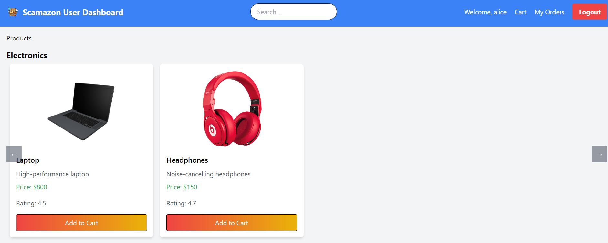

# Scamazon Database Documentation

## 1. Project Planning

### Project Title:
Scamazon - E-commerce Platform

### Define Objectives:
Scamazon is an e-commerce platform where users can buy and sell products. The system aims to provide a user-friendly interface for both buyers and sellers to interact with the platform. The primary objectives are:
- Enable users to browse and purchase products.
- Allow sellers to list and manage their products.
- Facilitate order tracking, reviews, and transactions.

## 2. Requirement Analysis

### System Specification:
#### Functional Requirements:
- User authentication and authorization.
- Product listing and search functionality.
- Shopping cart management.
- Order processing and tracking.
- Review and rating system for products and sellers.
- Seller dashboard for managing products and orders.

#### Non-Functional Requirements:
- Performance: The system should handle multiple concurrent users efficiently.
- Security: Ensure data protection and secure transactions.

### Data Requirements:
- Types of data: Users, Sellers, Products, Orders, Reviews, Transactions.
- Relationships: Users can place multiple orders, products can have multiple reviews, and sellers can list multiple products.
- Constraints: Unique identifiers for users, products, and orders; foreign key constraints to maintain data integrity.

## 3. Database Design

### Conceptual Design:
The Entity-Relationship (ER) diagram visualizes the entities, attributes, and relationships in the Scamazon database.

### Database Creation:
The database and tables are created using SQL scripts. The `database_creator.py` script handles the creation and population of the database.

The following SQL queries create the tables:

**Creation Of Essential Tables:**
 
```sql
CREATE TABLE User (
    user_id VARCHAR(5) PRIMARY KEY,
    username VARCHAR(50),
    email VARCHAR(100),
    password VARCHAR(100),
    contact VARCHAR(15),
    address TEXT
);

CREATE TABLE Seller (
    seller_id VARCHAR(5) PRIMARY KEY,
    proprietor_name VARCHAR(100),
    shop_name VARCHAR(100),
    email VARCHAR(100),
    password VARCHAR(100),
    username VARCHAR(50),
    contact VARCHAR(15),
    address TEXT,
    GSTIN VARCHAR(15),
    rating INT DEFAULT 0
);

CREATE TABLE Product (
    product_id VARCHAR(5) PRIMARY KEY,
    Name VARCHAR(100),
    category VARCHAR(50),
    description TEXT,
    price DECIMAL(10, 2),
    stock INT,
    rating INT DEFAULT 5,
    seller_id VARCHAR(5),
    FOREIGN KEY (seller_id) REFERENCES Seller(seller_id)
);

CREATE TABLE Cart (
    user_id VARCHAR(5),
    product_id VARCHAR(5),
    quantity INT,
    PRIMARY KEY (user_id, product_id),
    FOREIGN KEY (user_id) REFERENCES User(user_id),
    FOREIGN KEY (product_id) REFERENCES Product(product_id)
);

CREATE TABLE Orders (
    order_id VARCHAR(5) PRIMARY KEY,z
    user_id VARCHAR(5),
    product_id VARCHAR(5),
    quantity INT,
    order_date DATE,
    status VARCHAR(20),
    FOREIGN KEY (user_id) REFERENCES User(user_id),
    FOREIGN KEY (product_id) REFERENCES Product(product_id)
);

CREATE TABLE Product_Review (
    user_id VARCHAR(5),
    product_id VARCHAR(5),
    order_id VARCHAR(5),
    rating INT,
    review TEXT,
    PRIMARY KEY (user_id, product_id, order_id),
    FOREIGN KEY (user_id) REFERENCES User(user_id),
    FOREIGN KEY (product_id) REFERENCES Product(product_id),
    FOREIGN KEY (order_id) REFERENCES Orders(order_id)
);

CREATE TABLE Seller_Review (
    user_id VARCHAR(5),
    seller_id VARCHAR(5),
    order_id VARCHAR(5),
    rating INT,
    review TEXT,
    PRIMARY KEY (user_id, seller_id, order_id),
    FOREIGN KEY (user_id) REFERENCES User(user_id),
    FOREIGN KEY (seller_id) REFERENCES Seller(seller_id),
    FOREIGN KEY (order_id) REFERENCES Orders(order_id)
);
```


### Logical Design:
The ER diagram is converted into a relational schema with the following tables:

#### 1. Seller
| Field            | Type        | Null | Key | Default | Extra |
|------------------|-------------|------|-----|---------|-------|
| seller_id        | varchar(6)  | NO   | PRI | NULL    |       |
| proprietor_name  | varchar(50) | NO   |     | NULL    |       |
| shop_name        | varchar(50) | NO   |     | NULL    |       |
| email            | varchar(50) | NO   |     | NULL    |UNIQUE |
| password         | varchar(50) | NO   |     | NULL    |       |
| username         | varchar(50) | NO   |     | NULL    |UNIQUE |
| contact          | varchar(10) | NO   |     | NULL    |UNIQUE |
| address          | varchar(100)| NO   |     | NULL    |       |
| GSTIN            | varchar(15) | NO   |     | NULL    |UNIQUE |
| rating           | float       | NO   |     | NULL    |       |

**Normalization Analysis:**
- **1NF**: All columns contain atomic values.
- **2NF**: All non-key attributes (proprietor_name, shop_name, email, password, username, contact, address, GSTIN, rating) depend on the primary key (seller_id).
- **3NF**: No transitive dependencies.

#### 2. User
| Field            | Type        | Null | Key | Default | Extra |
|------------------|-------------|------|-----|---------|-------|
| user_id          | varchar(6)  | NO   | PRI | NULL    |       |
| username         | varchar(50) | NO   |     | NULL    |UNIQUE |
| email            | varchar(50) | NO   |     | NULL    |UNIQUE |
| password         | varchar(50) | NO   |     | NULL    |       |
| contact          | varchar(10) | NO   |     | NULL    |UNIQUE |
| address          | varchar(100)| NO   |     | NULL    |       |

**Normalization Analysis:**
- **1NF**: All columns contain atomic values.
- **2NF**: All non-key attributes (username, email, password, contact, address) depend on the primary key (user_id).
- **3NF**: No transitive dependencies.

#### 3. Product
| Field            | Type        | Null | Key | Default | Extra |
|------------------|-------------|------|-----|---------|-------|
| product_id       | varchar(6)  | NO   | PRI | NULL    |       |
| name             | varchar(50) | NO   |     | NULL    |       |
| category         | varchar(50) | NO   |     | NULL    |       |
| description      | text        | NO   |     | NULL    |       |
| price            | float       | NO   |     | NULL    |       |
| stock            | int         | NO   |     | NULL    |       |
| rating           | float       | NO   |     | NULL    |       |
| seller_id        | varchar(6)  | NO   | MUL | NULL    |       |
| warranty         | varchar(50) | YES  |     | NULL    |       |
| offer            | varchar(50) | YES  |     | NULL    |       |

**Normalization Analysis:**
- **1NF**: All columns contain atomic values.
- **2NF**: All non-key attributes (name, category, description, price, stock, rating, seller_id, warranty, offer) depend on the primary key (product_id).
- **3NF**: No transitive dependencies.

#### 4. Orders
| Field            | Type        | Null | Key | Default | Extra |
|------------------|-------------|------|-----|---------|-------|
| order_id         | varchar(6)  | NO   | PRI | NULL    |       |
| order_date       | date        | NO   |     | NULL    |       |
| status           | varchar(50) | NO   |     | NULL    |       |
| product_id       | varchar(6)  | NO   | MUL | NULL    |       |
| user_id          | varchar(6)  | NO   | MUL | NULL    |       |
| quantity         | int         | NO   |     | NULL    |       |
| received_date    | date        | YES  |     | NULL    |       |

**Normalization Analysis:**
- **1NF**: All columns contain atomic values.
- **2NF**: All non-key attributes (order_date, status, product_id, user_id, quantity, received_date) depend on the primary key (order_id).
- **3NF**: No transitive dependencies.

#### 5. Cart
| Field            | Type        | Null | Key | Default | Extra |
|------------------|-------------|------|-----|---------|-------|
| user_id          | varchar(6)  | NO   | MUL | NULL    |       |
| product_id       | varchar(6)  | NO   | MUL | NULL    |       |
| quantity         | int         | NO   |     | NULL    |       |

**Normalization Analysis:**
- **1NF**: All columns contain atomic values.
- **2NF**: All non-key attributes (user_id, product_id, quantity) depend on the composite primary key (user_id, product_id).
- **3NF**: No transitive dependencies.

#### 6. Product_Review
| Field            | Type        | Null | Key | Default | Extra |
|------------------|-------------|------|-----|---------|-------|
| user_id          | varchar(6)  | NO   | MUL | NULL    |       |
| product_id       | varchar(6)  | NO   | MUL | NULL    |       |
| order_id         | varchar(6)  | NO   | MUL | NULL    |       |
| rating           | float       | NO   |     | NULL    |       |
| review_text      | text        | YES  |     | NULL    |       |

**Normalization Analysis:**
- **1NF**: All columns contain atomic values.
- **2NF**: All non-key attributes (user_id, product_id, order_id, rating, review_text) depend on the composite primary key (user_id, product_id, order_id).
- **3NF**: No transitive dependencies.

#### 7. Transaction
| Field            | Type        | Null | Key | Default | Extra |
|------------------|-------------|------|-----|---------|-------|
| transaction_id   | varchar(6)  | NO   | PRI | NULL    |       |
| user_id          | varchar(6)  | NO   | MUL | NULL    |       |
| order_id         | varchar(6)  | NO   | MUL | NULL    |       |
| amount           | float       | NO   |     | NULL    |       |
| transaction_date | datetime    | NO   |     | NULL    |       |

**Normalization Analysis:**
- **1NF**: All columns contain atomic values.
- **2NF**: All non-key attributes (user_id, order_id, amount, transaction_date) depend on the primary key (transaction_id).
- **3NF**: No transitive dependencies.

#### 8. Seller_Review
| Field            | Type        | Null | Key | Default | Extra |
|------------------|-------------|------|-----|---------|-------|
| user_id          | varchar(6)  | NO   | MUL | NULL    |       |
| seller_id        | varchar(6)  | NO   | MUL | NULL    |       |
| order_id         | varchar(6)  | NO   | MUL | NULL    |       |
| rating           | float       | NO   |     | NULL    |       |
| review_text      | text        | YES  |     | NULL    |       |

**Normalization Analysis:**
- **1NF**: All columns contain atomic values.
- **2NF**: All non-key attributes (user_id, seller_id, order_id, rating, review_text) depend on the composite primary key (user_id, seller_id, order_id).
- **3NF**: No transitive dependencies.

### SQL Query Headlines

```sql
1.  Delete Product from Cart
    DELETE FROM Cart WHERE user_id="{user_id}" AND 
    product_id="{product_id}";

2.  Update Cart Quantity
    UPDATE Cart SET quantity={qty[0]+1} WHERE user_id=" 
    {user_id}" AND product_id="{product_id}";

3.  Update Stock Quantity
    UPDATE Product SET stock=stock+{stock} WHERE 
    product_id="{product_id}";

4.  Update Order Status to Shipped
    UPDATE Orders SET status="Shipped" WHERE order_id=" 
    {order_id}";

5.  Update Order Status to Delivered
    UPDATE Orders SET status="Delivered" WHERE order_id=" 
    {order_id}";
```

### Normalization:
The database is normalized up to the Third Normal Form (3NF) to reduce redundancy and improve data integrity.

## 4. Implementation

### Data FLow
 
  1. **1. User Registration/Login:**  Users create an account or log in to access their dashboard.
    

  2. **seller dashboard** 
    
  3. **User dashboard**
    
  4. **Cart view** 
    

### Coding:
SQL queries for CRUD operations (Create, Read, Update, Delete) are written in the backend code. For example, the `ProductReview` class in `product_review.py` contains methods for inserting, updating, and deleting product reviews.

### Stored Procedures and Triggers:
Stored procedures and triggers are implemented to automate certain tasks. For example, triggers are used to update the average rating of products and sellers after a new review is inserted.

### User Interface (UI) Design:
A basic UI is developed using React.js to interact with the database. The frontend code is located in the `Frontend` directory and includes components for user authentication, product listing, cart management, and order processing.

## ER Diagram


## 5. Conclusion

The Scamazon project is an e-commerce platform designed to facilitate interactions between buyers and sellers. It incorporates functionalities like user and seller registration, product listings, cart management, and order processing. Users can browse available products, add items to their cart, and place orders, while sellers can manage product inventory and view order details. The platform also supports product reviews and seller ratings, enhancing transparency and user experience. Built with a Flask-based backend, Scamazon integrates MySQL for data storage, ensuring a structured and scalable approach to handling user, product, and transaction data.

## Contributors
- [Kanishk Mittal](https://github.com/Kanishk-mittal)
- [Sayan Sinha](https://github.com/sayan23bcy6)
- [Roshan Binoj](https://github.com/roshanbinoj-iiitk)
- [Nikhil Kumar](https://github.com/sawarn-nik)
- [Vishwanath Prakash Darur](https://github.com/vishwanathdarur)